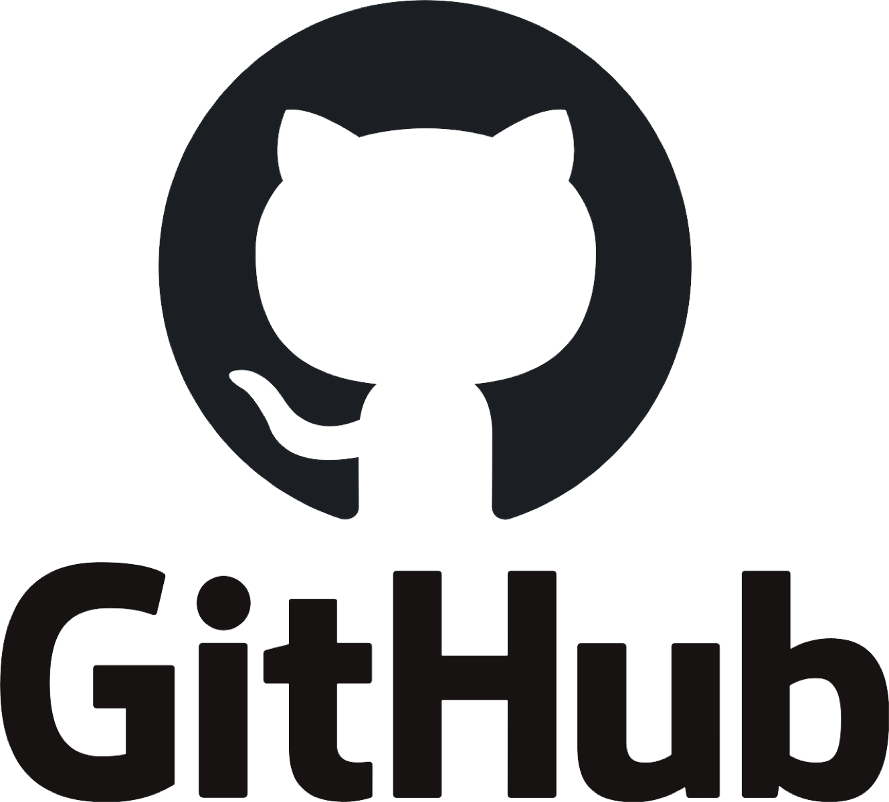
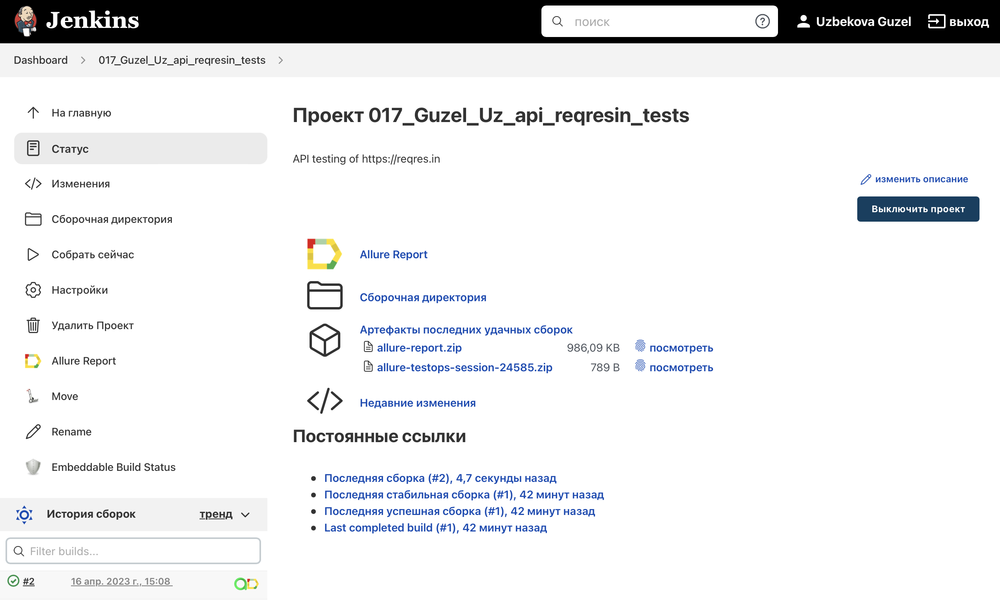
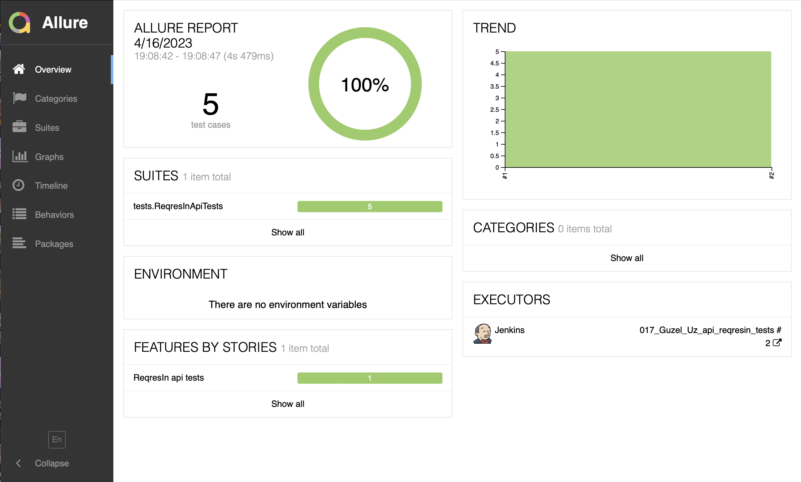
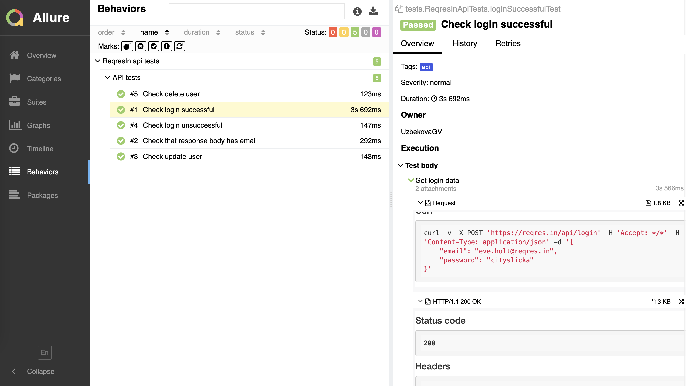
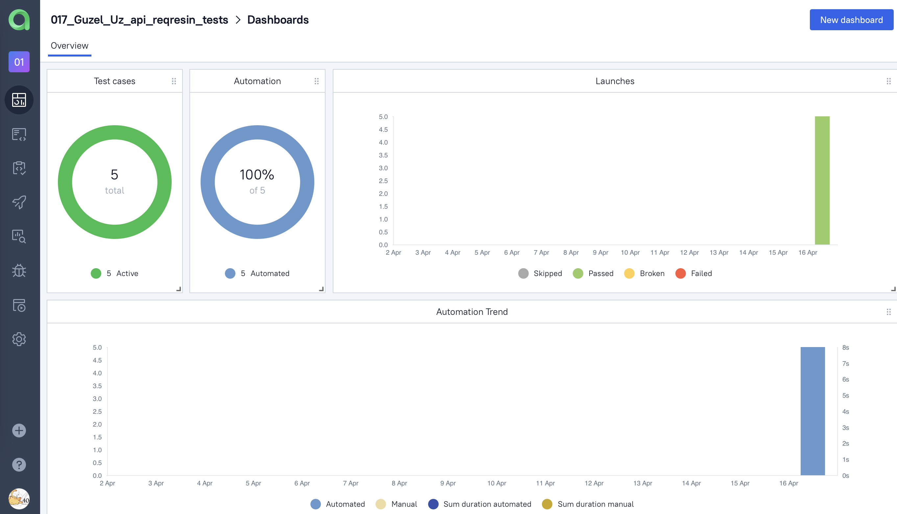
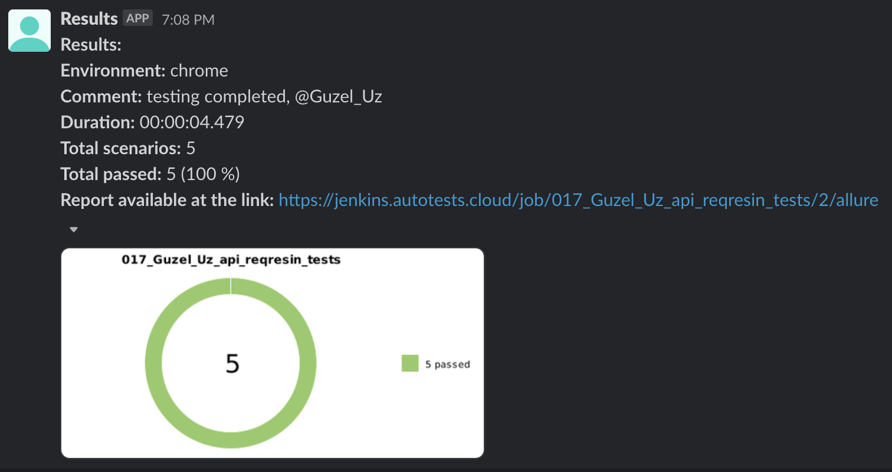

<h1 >Проект автоматизации API для сайта <a href="https://reqres.in/ ">reqres.in</a></h1>

## Содержание

* <a href="#tools">Технологии и инструменты</a>
* <a href="#cases">Автоматизированные проверки</a>
* <a href="#console">Запуск тестов</a>
* <a href="#jenkins">Запуск тестов в Jenkins</a>
* <a href="#allure">Отчеты в Allure</a>
* <a href="#testops">Интеграция с Allure TestOps</a>
* <a href="#telegram">Уведомления в Telegram и Slack с использованием бота</a>

<a id="tools"></a>
## Технологии и инструменты

<div align="center">
<a href="https://www.jetbrains.com/idea/"></a>
<a href="https://github.com/"></a>  
<a href="https://www.java.com/"></a>
<a href="https://gradle.org/"></a>  
<a href="https://junit.org/junit5/"></a>
<a href="https://selenide.org/"></a>
<a href="https://rest-assured.io/"></a>
<a href="https://www.jenkins.io/"></a>
<a href="https://github.com/allure-framework/"></a>
<a href="https://qameta.io/"></a>
<a href="https://telegram.org/"></a>
<a href="https://telegram.org/"></a>
</div>

Автотесты написаны на `Java` с использованием `JUnit 5` и `Gradle`.

Краткий список интересных фактов о проекте:
- [x] Использование `Lombok` для моделей в API тестах
- [x] Использование request/response спецификаций для API тестов
- [x] Custom Allure listener для API requests/responses логов
- [x] Cборка в `Jenkins`
- [x] Формирование Allure-отчета
- [x] Интеграция с `Allure TestOps`
- [x] Отправка уведомления с результатами в `Telegram` и `Slack`

<a id="cases"></a>
## Автоматизированные проверки
:heavy_check_mark: Check login successful

:heavy_check_mark: Check login unsuccessful

:heavy_check_mark: Check update user

:heavy_check_mark: Check delete user

:heavy_check_mark: Check that response body has email

<a id="console"></a>
##  Запуск тестов

```
gradle clean api_test 
```

<a id="jenkins"></a>
## Запуск тестов в <a target="_blank" href="https://jenkins.autotests.cloud/job/017_Guzel_Uz_api_reqresin_tests/"> Jenkins </a>

<p align="center">

</p>

<a id="allure"></a>
## Отчеты в <a target="_blank" href="https://jenkins.autotests.cloud/job/017_Guzel_Uz_api_reqresin_tests/2/allure/"> Allure report </a>

### Основное окно

<p align="center">

</p>

### Тесты

<p align="center">

</p>

<a id="testops"></a>
## Интеграция с <a target="_blank" href="https://allure.autotests.cloud/project/2181/dashboards"> Allure TestOps </a>

### Доска
<p align="center">

</p>

<a id="telegram"></a>
## Уведомления в Telegram с использованием бота

<p>

</p>

<a id="slack"></a>
## Уведомления в Slack с использованием бота

<p>

</p>
